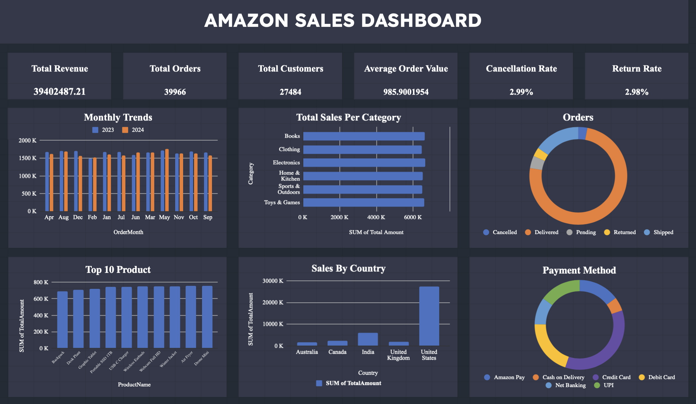

# Amazon Sales Analysis
A data analytics project exploring two years of Amazon transactional data to understand revenue performance, customer behavior, order fulfillment health, and market concentration, presented through an interactive dashboard.

  

## Project Overview
This project analyzes order-level sales data from an Amazon-style marketplace covering the years 2023 and 2024. The raw transactional log was cleaned, aggregated, and visualized into a single-page dashboard that gives business stakeholders an at-a-glance view of revenue, order volume, customer reach, fulfillment quality, and payment behavior.

The dashboard was built to answer one central question: **is the business growing in a healthy way, and where should attention be focused next?**

---

## The Problem Statement
An e-commerce operations team has access to raw order data but no consolidated view of performance. Decisions about inventory, marketing spend, logistics, and customer experience are currently being made without clear visibility into:

- How much revenue is actually being generated, and whether it is growing or flat.
- How efficiently orders convert into successful deliveries versus cancellations and returns.
- Which product categories and specific products are driving the most sales.
- Where customers are geographically located, and whether the business is overexposed to a single market.
- Which payment methods customers prefer, which affects checkout design and fraud/refund handling.

Without answering these questions, the business risks misallocating marketing budget toward underperforming regions, ignoring rising cancellation or return trends, and underinvesting in the categories and products that matter most to customers.

**The goal of this analysis is to turn raw order data into a decision-ready dashboard that surfaces these answers clearly and highlights where the business should act.**

---

## Dataset Description

The dataset consists of individual order records with the following fields:

| Field | Description |
|---|---|
| OrderID, OrderDate, OrderMonth, OrderYear | Order identifiers and timing |
| CustomerID, CustomerName | Customer identifiers |
| ProductID, ProductName, Category, Brand | Product details |
| Quantity, UnitPrice, TotalPrice | Line-level sales figures |
| Discount, Tax, ShippingCost, TotalAmount | Pricing and cost breakdown |
| PaymentMethod | Payment channel used at checkout |
| OrderStatus | Delivered, Cancelled, Returned, Pending, or Shipped |
| City, State, Country | Customer location |
| SellerID | Seller fulfilling the order |

The data spans two full years (2023-2024) and covers customers across multiple countries, giving enough depth to analyze seasonality, category performance, and geographic concentration.

---

## Tools Used

- **Data Cleaning and Aggregation:** Spreadsheet-based data preparation (pivot tables, calculated fields for AOV, cancellation rate, and return rate)
- **Dashboard Design:** Business intelligence visualization tool for KPI cards, bar charts, donut charts, and trend charts
- **Version Control and Documentation:** Markdown documentation for reproducibility and stakeholder communication

---

## The Story: From Data to Decisions

**Chapter 1 - Setting the scene**

The business has processed close to 40,000 orders from over 27,000 customers, generating roughly 39.4 million dollars in revenue. On the surface, this looks like a healthy, established operation. But headline numbers alone do not tell an operations team where to focus. The story really begins when we break the topline figures down by time, geography, category, and fulfillment outcome.

**Chapter 2 - Is growth actually happening?**

Looking at the monthly trend comparing 2023 against 2024, order volume and revenue stay remarkably flat month over month, hovering consistently between roughly 1.5 million and 1.7 million per month, with no clear seasonal spike or year-over-year growth pattern. This is the first sign that the business, while stable, is not currently expanding.

**Chapter 3 - Where is the revenue coming from?**

Breaking revenue down by category shows a surprisingly even spread across Books, Clothing, Electronics, Home and Kitchen, Sports and Outdoors, and Toys and Games. No single category dominates, and the Top 10 product chart tells the same story: individual products each contribute a similar, modest share of total sales rather than a handful of bestsellers driving the business. This is a diversified catalog, not a hits-driven one.

**Chapter 4 - Is the business too dependent on one market?**

The geographic breakdown is where the story sharpens. The United States accounts for the overwhelming majority of revenue, dwarfing India, Canada, the United Kingdom, and Australia combined. This concentration is a strength in that the core market is strong, but it is also a risk: any disruption in the US market has an outsized effect on total revenue, and the other four markets remain largely untapped.

**Chapter 5 - Are customers actually getting their orders?**

Fulfillment health is generally strong. The order status donut chart shows that the large majority of orders are Delivered, with a healthy share Shipped, and only small slices for Cancelled, Pending, and Returned. This is confirmed by the KPI cards: a Cancellation Rate of 2.99 percent and a Return Rate of 2.98 percent. Both are low in absolute terms, but the fact that they are almost identical is worth investigating further, as it suggests overlapping root causes such as pricing errors, delivery delays, or product mismatches.

**Chapter 6 - How are customers paying?**

Payment method usage is fragmented across Credit Card, Debit Card, UPI, Net Banking, Amazon Pay, and Cash on Delivery, with Credit Card and Debit Card leading. No single method dominates checkout, meaning the platform needs to support a genuinely diverse set of payment experiences rather than optimizing for just one.

---

## Key Insights

- Revenue and order volume are stable but essentially flat across 2023 and 2024, with no visible growth trend.
- Category and product-level sales are evenly distributed, indicating a broad, diversified catalog rather than a small number of hero products.
- The United States contributes the vast majority of total revenue, while India, Canada, the United Kingdom, and Australia remain minor markets by comparison.
- Cancellation rate (2.99 percent) and return rate (2.98 percent) are both low but nearly equal, suggesting shared upstream causes worth investigating.
- Payment preferences are fragmented across six methods, with Credit Card and Debit Card as the leading channels.
- Average Order Value sits at approximately 985.90, indicating customers typically purchase mid-to-higher value baskets rather than single low-cost items.

---

## Findings Summary

| Area | Finding |
|---|---|
| Revenue Growth | Flat month-over-month performance across both years |
| Product Mix | Broad, evenly distributed catalog with no single dominant category or product |
| Geographic Concentration | Over-reliance on the United States market |
| Fulfillment Quality | Low cancellation and return rates, but nearly identical, pointing to a possible shared root cause |
| Payment Behavior | No dominant payment method; checkout experience must support multiple channels |
| Customer Value | Solid average order value near 986, suggesting healthy basket sizes |

---

## Recommended Solutions

1. **Diversify geographic revenue.** Launch targeted marketing and localized promotions in India, Canada, the UK, and Australia to reduce dependency on the US market and build a second and third growth engine.
2. **Investigate the shared driver behind cancellations and returns.** Since both rates sit at almost the same level, review order data for patterns such as delayed shipping, pricing or description mismatches, or specific sellers and categories with disproportionately high cancellation or return activity.
3. **Introduce growth initiatives rather than relying on organic trend.** Since revenue is flat year-over-year, consider seasonal campaigns, bundling, loyalty programs, or cross-category promotions to break the plateau.
4. **Protect and streamline the payment experience.** Given the fragmented payment method split, ensure all major channels remain fast, low-friction, and well-supported at checkout, since a poor experience on any one method could depress conversion.
5. **Use the even category spread as a strength.** Rather than over-investing in a single category, continue balanced inventory planning while testing which categories respond best to promotional spend, to identify where a modest push could create a clearer bestseller.

---

## Conclusion

This analysis shows a business that is operationally stable, with strong fulfillment rates and a healthy average order value, but one that has plateaued in growth and is heavily concentrated in a single geographic market. The dashboard translates raw order-level data into a clear narrative: the foundation is solid, but the next phase of growth depends on geographic diversification, a closer look at what is driving cancellations and returns, and deliberate initiatives to move revenue off its current flat trajectory.