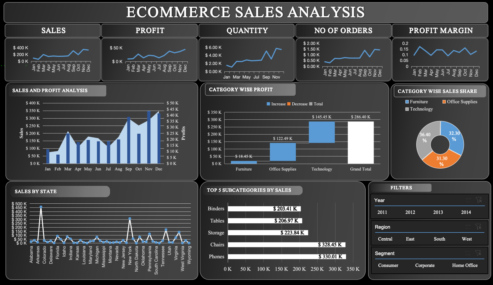

# Ecommerce Sales Analysis Dashboard

## Overview

This project presents an interactive Ecommerce Sales Analysis Dashboard built in Microsoft Excel. The dashboard consolidates sales, profit, quantity, and order data across regions, states, product categories, and time periods, enabling stakeholders to monitor business performance and identify actionable trends at a glance.

The dashboard is designed for business users, sales managers, and analysts who need a consolidated view of ecommerce performance without navigating raw transactional data.

## Dashboard Preview

## Objective

The primary objective of this dashboard is to:

- Track overall sales, profit, quantity, and order trends over a 12-month period
- Evaluate profitability by product category
- Identify top-performing product subcategories
- Analyze sales distribution across U.S. states
- Enable dynamic filtering by year, region, and customer segment

## Key Features

### 1. KPI Summary Cards
Five headline metrics are displayed at the top of the dashboard, each accompanied by a monthly trend sparkline:
- **Sales** - Total revenue generated
- **Profit** - Total profit earned
- **Quantity** - Total units sold
- **No of Orders** - Total number of orders placed
- **Profit Margin** - Profit as a percentage of sales

### 2. Sales and Profit Analysis
A combination chart displaying monthly sales (bar) against profit (line) on a dual axis, allowing quick comparison of revenue growth versus profitability across the year.

### 3. Category Wise Profit
A waterfall chart breaking down profit contribution by product category (Furniture, Office Supplies, and Technology), culminating in the grand total profit.

### 4. Category Wise Sales Share
A donut chart illustrating the proportional contribution of each product category to total sales.

### 5. Sales by State
A line chart mapping sales performance across individual U.S. states, highlighting states with unusually high sales volume compared to the rest.

### 6. Top 5 Subcategories by Sales
A horizontal bar chart ranking the five best-performing product subcategories by total sales value.

### 7. Interactive Filters (Slicers)
The dashboard includes slicers for:
- **Year** (2011, 2012, 2013, 2014)
- **Region** (Central, East, South, West)
- **Segment** (Consumer, Corporate, Home Office)

These filters allow users to dynamically drill down into the data and view results specific to a chosen time period, geography, or customer segment.

## Key Insights

1. **Consistent year-end growth.** Sales, profit, quantity, and order volume all trend upward from mid-year through December, with the strongest performance concentrated in the September to December period, indicating a seasonal or year-end demand surge.

2. **Profit margin volatility.** Unlike sales and profit, which show steady growth, the profit margin fluctuates between roughly 5 percent and 20 percent through the year, suggesting that revenue growth is not always matched by proportional profitability, likely due to discounting or cost variations in certain months.

3. **Technology leads profitability.** Technology is the leading contributor to profit at approximately 145,000 dollars, followed by Office Supplies at approximately 122,000 dollars, while Furniture contributes the least at approximately 18,000 dollars despite a comparable sales share, pointing to thin margins in the Furniture category.

4. **Balanced sales distribution across categories.** Technology accounts for the largest share of sales at approximately 36 percent, followed closely by Furniture at approximately 32 percent and Office Supplies at approximately 31 percent, showing a relatively even split in revenue contribution despite the disparity in profit.

5. **Furniture sales do not translate to profit.** Although Furniture holds a comparable sales share to the other two categories, it generates a disproportionately small share of total profit, making it a priority area for margin improvement or pricing review.

6. **Phones and Chairs drive subcategory performance.** Phones (approximately 330,000 dollars) and Chairs (approximately 328,000 dollars) are the top-selling subcategories, followed by Storage, Tables, and Binders, indicating that high-value individual items are the primary revenue drivers.

7. **Sales concentration in select states.** A small number of states show sharply higher sales than the rest of the dataset, indicating strong regional demand concentration rather than an even geographic spread. Most other states maintain comparatively low and consistent sales levels.

8. **Data spans a four-year period.** The dataset covers transactions from 2011 through 2014, allowing for year-over-year comparison when the year filter is applied.

## Recommendations

- Review pricing and cost structure for the Furniture category to close the gap between its sales share and its profit contribution.
- Investigate the drivers behind high-performing states to replicate successful strategies in underperforming regions.
- Prioritize inventory and marketing focus on Phones, Chairs, and Storage, which generate the highest subcategory revenue.
- Examine monthly cost or discount patterns to stabilize profit margin and reduce volatility.

## Tools and Techniques Used

- Microsoft Excel
- PivotTables and PivotCharts
- Combination (bar and line) charts
- Waterfall chart
- Doughnut chart
- Slicers for interactive filtering
- Dashboard layout design and formatting

## How to Use

1. Open the Excel workbook file.
2. Use the Year, Region, and Segment slicers to filter the dashboard views.
3. Review the KPI cards for a quick summary of overall performance.
4. Explore individual charts for category, subcategory, and state-level detail.
5. Charts and KPIs update dynamically based on the filters applied.