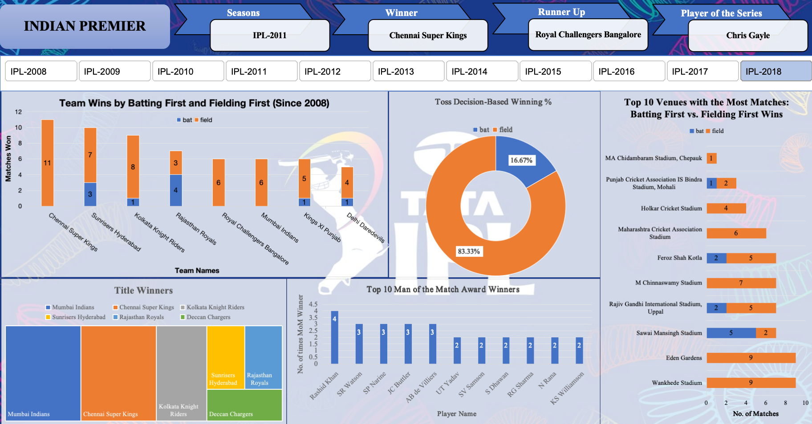

# The IPL Story: A Decade in Data (2008–2018)
This project began with a simple curiosity: **what does a decade of the Indian Premier League actually look like when you strip away the commentary and just look at the numbers?** The result is a fully interactive **MIS-style Excel Dashboard** that turns raw match data into a season-by-season story — winners, venues, toss decisions, and the players who owned the "Man of the Match" trophy again and again.

---

## Dashboard Preview

  

*Built entirely in Excel — dynamic, interactive, and season-driven. Click a season button (IPL-2008 → IPL-2018) and the entire dashboard reshapes itself.*

---

## The Story So Far
Every good story needs a setting. Ours starts in **2008**, the year IPL was born, and runs through **2018** — ten seasons of chaos, comebacks, and champions.

Instead of scrolling through a flat spreadsheet, this dashboard lets you **pick a season and watch the story rebuild itself in real time**:

- Who lifted the trophy that year?
- Who fell just short as the runner-up?
- Which player stood taller than everyone else in the series?

It's the difference between *reading* a stats sheet and *living* through a season.

---

## Key Findings

### 1. Fielding First Is (Mostly) the Winning Move
Across a decade of matches, teams that **chose to field first won a staggering 83.33%** of the time, compared to just **16.67% for teams batting first**. Chasing under lights, with a clear target on the board, has clearly been the smarter gamble in IPL history.

### 2. Chennai Super Kings — The Quiet Dominators
When you break down wins by "bat first vs. field first," **Chennai Super Kings top the charts with 11 wins**, almost entirely built on strong chases. Close behind:
- **Sunrisers Hyderabad** — 10 wins (7 fielding, 3 batting)
- **Kolkata Knight Riders** — 9 wins (8 fielding, 1 batting)
- **Rajasthan Royals** — 7 wins (a rare team with more bat-first wins than most)

### 3. Home Turf Advantage Has Its Kings
Looking at the **Top 10 venues by matches played**, two stadiums stand out as fortress grounds:
- **Eden Gardens** and **Wankhede Stadium** — both hosting **9 matches** each, almost entirely won by the fielding side.
- **M Chinnaswamy Stadium** follows closely with **7 matches**, again dominated by chasing teams.

The pattern is consistent everywhere: **fielding-first wins outnumber batting-first wins at almost every major venue.**

### 4. The Trophy Cabinet Tells Its Own Tale
The title-winners breakdown (visualized as a treemap) makes it visually obvious who has ruled the IPL era:
- **Mumbai Indians** — the single largest share of titles
- **Chennai Super Kings** — right behind
- **Kolkata Knight Riders**, **Sunrisers Hyderabad**, **Rajasthan Royals**, and **Deccan Chargers** make up the rest of a fairly exclusive club.

### 5. The Rashid Khan Show
When it comes to individual brilliance, **Rashid Khan leads the Top 10 Man of the Match award winners with 4 awards**, edging out a tightly packed group of legends tied at 3 each: **SR Watson, SP Narine, JC Buttler, and AB de Villiers**. A cluster of stars — including **UT Yadav, SV Samson, S Dhawan, RG Sharma, N Rana, and KS Williamson** — sit just behind with 2 awards apiece.

### 6. A Sample Season Snapshot: IPL-2011
As one example of how the dashboard tells a season's story:
- 🏆 **Winner:** Chennai Super Kings
- 🥈 **Runner Up:** Royal Challengers Bangalore
- 🌟 **Player of the Series:** Chris Gayle

---

## What This Project Covers
This wasn't just about charts — it was about building a genuine **MIS (Management Information System) dashboard** from scratch, the way an analyst would for a real business report:

- ✅ Data cleaning before dashboard development
- ✅ Pivot Tables & Pivot Charts as the analytical backbone
- ✅ A fully **dynamic dashboard** (season selector buttons drive every visual)
- ✅ Top 10 style analyses (venues, players, teams)
- ✅ Thoughtful dashboard **layout & KPI design**
- ✅ Custom **shapes and icons** for visual clarity
- ✅ **Calculated fields** for derived metrics
- ✅ **Advanced Excel formulae** powering the logic
- ✅ Polished **chart design and formatting**
- ✅ Answers to common **MIS interview questions**, worked through in the design process itself

---

## Tools Used
| Tool | Purpose |
|------|---------|
| Microsoft Excel | Data cleaning, Pivot Tables, Pivot Charts, dashboard design |
| Excel Formulae | Calculated fields, dynamic KPI logic |
| Shapes & Icons | Custom visual elements for storytelling |
| Slicers / Buttons | Season-based interactivity |

---

## Closing Thought
A dashboard is really just a story told through numbers instead of paragraphs. This one happens to be about bat-and-ball battles, home-ground fortresses, and the players who kept showing up when it mattered most. Ten seasons, one spreadsheet, and a lot of cricket — all in one click.