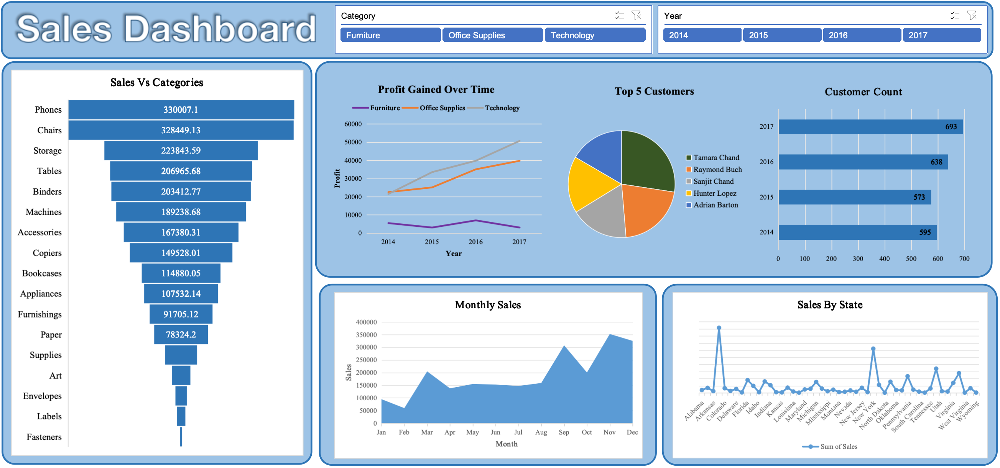

# Company Sales Dashboard — A Data Story (2014–2017)
> *Turning four years of raw transactional records into a single visual story about what the company sells, who buys it, and where the money moves.*

  

---

## The Story Behind the Numbers
Every dataset hides a story — it just isn't told yet. This project starts with a raw sales export full of order dates, customer names, states, categories, and products, and ends with an interactive dashboard that lets anyone ask *"how is the business doing?"* and get an answer in seconds.

The narrative below walks through the journey in four chapters: **cleaning the data**, **exploring the categories**, **following the money over time**, and **meeting the customers and markets** that drive the business.

---

## Chapter 1: Cleaning and Preparing the Data

Before any chart could be trusted, the raw data needed to be validated. The source file looked like this:

**Steps taken to clean and validate the dataset:**

| Step | Action |
|------|--------|
| 1 | Removed duplicate and blank rows |
| 2 | Standardized date formats and extracted `Year` and `Month` from `Order Date` |
| 3 | Verified `State`, `Category`, and `Sub-Category` values for consistent spelling/casing |
| 4 | Checked `Customer Name` and `Product Name` fields for typos and merged duplicate entries |
| 5 | Validated numeric fields (Sales, Profit) for outliers and negative/null values |
| 6 | Structured the data into a clean, dashboard-ready table |

Only after this cleanup did the data become reliable enough to drive decisions.

---

## Chapter 2: What Does the Company Actually Sell?
The **Sales vs Categories** funnel chart tells the first part of the story — not every product contributes equally.

- **Phones** and **Chairs** are the two heavyweight champions, each generating over **₹320K+** in sales — almost neck and neck.
- **Storage**, **Tables**, and **Binders** form a strong second tier (₹200K–₹224K).
- The tail of the funnel — **Labels**, **Envelopes**, **Fasteners** — barely registers, showing a classic **80/20 pattern**: a handful of sub-categories drive most of the revenue, while many low-value items exist mostly to complete the catalog.

**Insight:** Technology and Furniture-related items outperform basic Office Supplies, suggesting the company's real strength is in higher-ticket products.

---

## Chapter 3: Following the Money Over Time

The **Profit Gained Over Time** line chart shifts the story from *what* sells to *how profitable* it is.

- **Technology** shows the strongest and most consistent profit growth — climbing from ~₹23K in 2014 to over ₹50K in 2017.
- **Office Supplies** grows steadily too, nearly doubling over the same period.
- **Furniture**, however, stays almost flat near the bottom of the chart the entire time — a signal that this category may have pricing, cost, or discounting problems even though it sells well in volume (recall Chairs and Tables ranked high in raw sales!).

**Insight:** High sales volume does **not** always mean high profit. Furniture is a volume business with a profitability problem — a red flag worth investigating (discount rates, shipping costs, or return rates).

The **Monthly Sales** trend below adds a seasonal layer to this story: sales dip in **February**, stay flat through mid-year, and then surge sharply from **September to November**, peaking before a slight December pullback — a classic **year-end buying season** pattern.

---

## Chapter 4: Who Buys, and From Where?

The final chapter of the dashboard is about people and places.

-  **Top 5 Customers** (Tamara Chand, Raymond Buch, Sanjit Chand, Hunter Lopez, Adrian Barton) form a fairly balanced pie — no single customer dominates, which is healthy for business risk.
- **Customer Count** has grown every year — from **595 customers in 2014** to **693 in 2017** — showing steady expansion of the customer base, not just repeat sales to the same people.
- **Sales by State** reveals sharp geographic spikes — most notably a massive outlier in **New York** and a smaller one in **Colorado**, while most other states contribute modestly and evenly. This suggests regional concentration risk: the business currently leans heavily on a couple of key states.

**Insight:** Growth is coming from acquiring new customers, but revenue is geographically concentrated — an opportunity to expand marketing in underperforming states.

---

## Putting It All Together

| Perspective | Key Takeaway |
|---|---|
| **Product** | Phones & Chairs lead sales, but a long tail of low-value items exists |
| **Profitability** | Technology is the profit engine; Furniture underperforms despite good sales |
| **Time** | Clear seasonal peak in Sep–Nov; slow start to the year |
| **Customers** | Balanced top-5 customer base with steady year-on-year growth |
| **Geography** | Sales are concentrated in a few states (notably New York), signaling room for regional expansion |

---

## Tools & Filters Used
The dashboard includes interactive filters for:
- **Category** (Furniture / Office Supplies / Technology)
- **Year** (2014–2017)

These slicers let any stakeholder — from sales to finance to regional managers — filter the story to their own perspective instantly.

---

## Why This Dashboard Matters

This isn't just a collection of charts — it's a decision-support tool. In one glance, leadership can spot:
1. Which products to double down on (Technology)
2. Which category needs a profitability review (Furniture)
3. When to ramp up inventory and staffing (Sep–Nov)
4. Where to invest in customer acquisition (states beyond NY/Colorado)
---

  <i>Built with careful data cleaning, thoughtful visualization design, and a focus on turning numbers into a narrative.</i>

